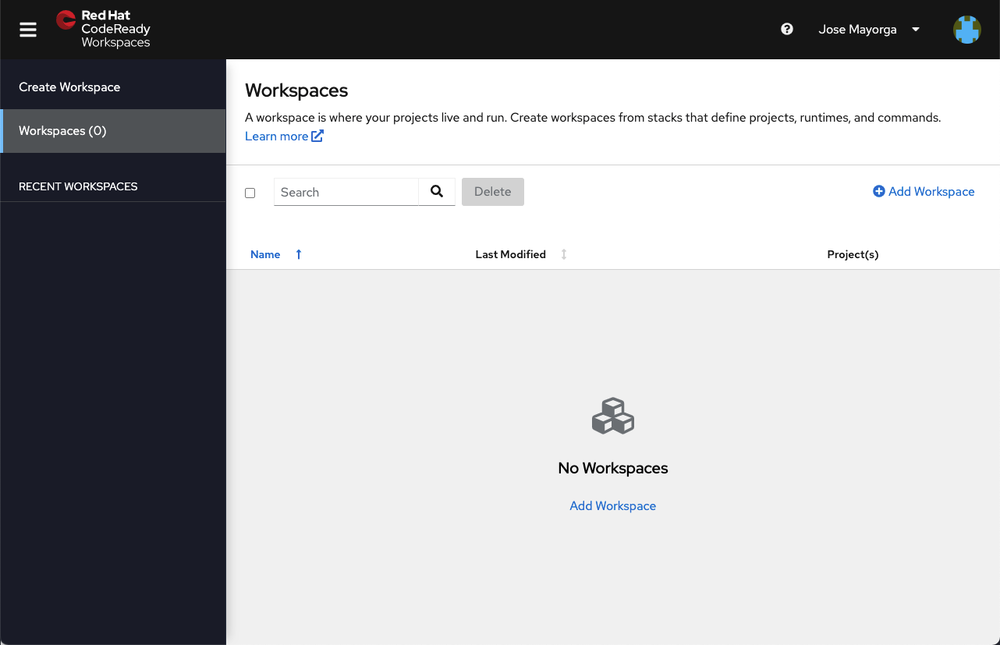
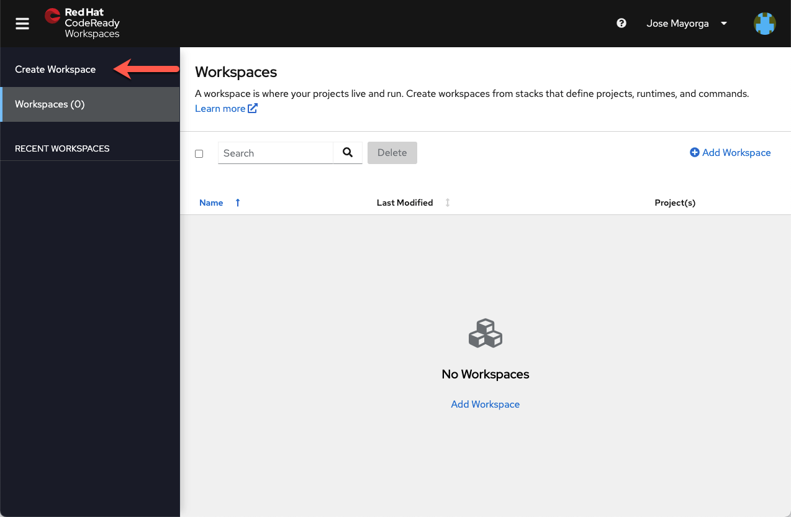

# Red Hat CodeReady Workspaces Workshop

:::warning
Credentials will be assigned during the workshop
:::

## Environment Access

You will be using [Red Hat CodeReady Workspaces](https://developers.redhat.com/products/codeready-workspaces/overview),
an online IDE. Changes to files are auto-saved every few seconds,
so you don't need to explicitly save changes.

To get started, access the CodeReady Workspaces Dashboard and
log in using the username and password you've been assigned.

| Name | URL |
| -------- | -------- |
| OCP Console | <https://console-openshift-console.apps.cluster-40fb.40fb.sandbox1485.opentlc.com> |
| CodeReady Workspaces Dashboard | <https://codeready-openshift-workspaces.apps.cluster-40fb.40fb.sandbox1485.opentlc.com/dashboard/#/workspaces> |

## Creating a new Workspace

Once you log in, you'll be placed on your personal dashboard.

You can create a new Workspace in multiple ways

### Create new project

Clone the project <https://github.com/jlmayorga/crw-workshop-quarkus>
